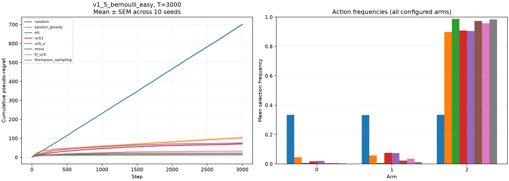
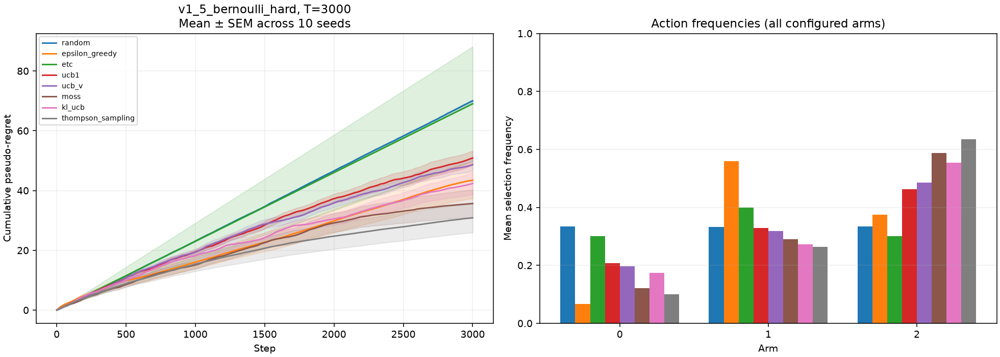
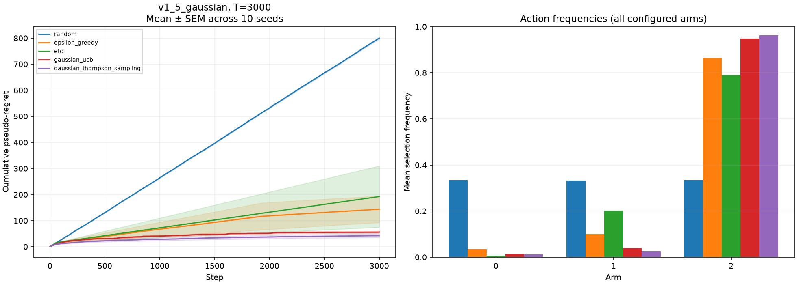

# v1.5 实验解读

本次参数在运行前固定，未按结果搜索。所有数值来自自动生成的 `benchmark_summary_v1_5.csv`。

## 三个重点现象

1. **ETC 的理想场景与失败代价。** easy-gap 中每个臂探索 20 次，固定探索损失为 20×(0.5+0.2+0)=14。十个 seed 都锁定臂 2，所以 T=1000 和 3000 的 regret 都是 14，std 接近浮点零。这是当前十条路径共同成功的结果，不是算法保证。hard-gap T=3000 的 ETC 均值 69.02、std 60.49，Gaussian 则均值 192.40、std 371.88，显示早期误判后不再切换的代价。
2. **乐观评分与后验采样的有限预算差异。** Bernoulli easy-gap T=3000，TS 12.54、MOSS 21.30、KL-UCB 32.36、UCB1 70.39、UCB-V 75.96。hard-gap 对应 TS 30.879、MOSS 35.658、KL-UCB 42.384、UCB-V 48.653、UCB1 50.894。UCB-V 的有限样本修正与方差收益共同作用，不保证总优于 UCB1。
3. **Gaussian 不只检验环境采样。** 在均值 [0,0.2,0.5]、std=1 的配置，T=3000 下 Gaussian TS 均值 42.22、Gaussian UCB 56.01，两个已知噪声策略都显著低于 Random 的观测均值 799.81；这里“低于”仅描述数值，不是配对显著性检验结论。ε-Greedy 均值 144.11 且标准差 161.52，提示早期路径仍可能影响有限预算表现。

## 为什么不据此做普遍排名

当前是三种环境、两个 T、十个 seed。ε 与 m 固定，未针对 gap 调参；MOSS 获知 T，Gaussian 两策略获知噪声尺度；各算法使用的先验假设不完全相同。比较说明实现与有限样本行为，并不证明最优调参后的家族排名、渐近界或统计显著性。

## 图表

其余三个 T=1000 图在同目录。阴影为均值±SEM，条形图为跨 seed 平均动作频率。
