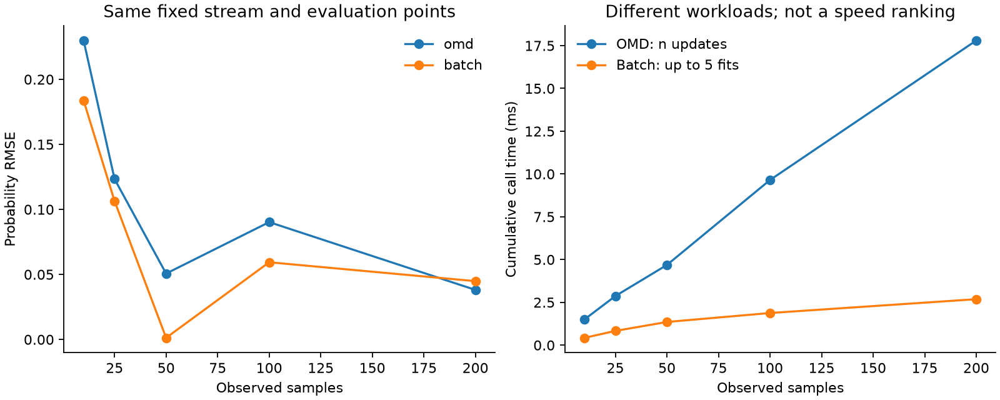
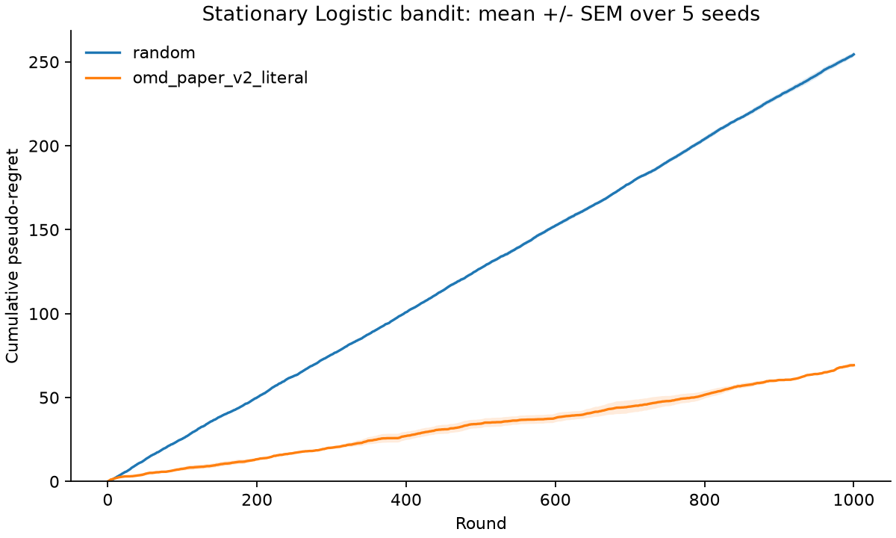
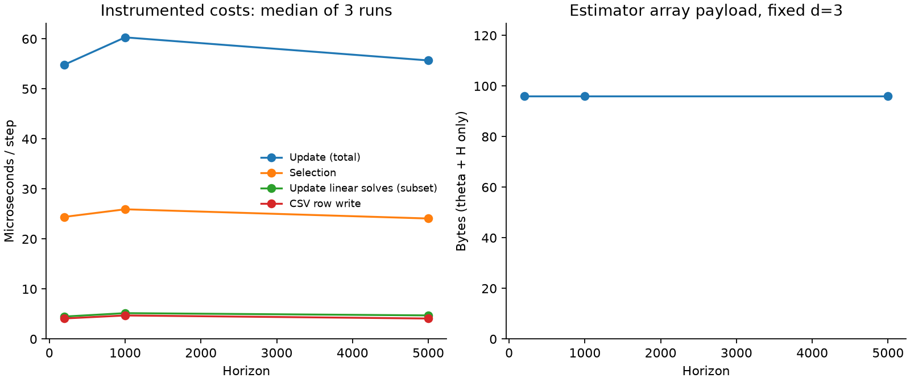
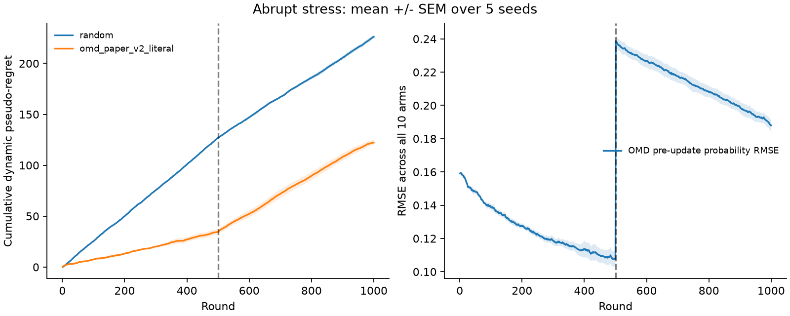
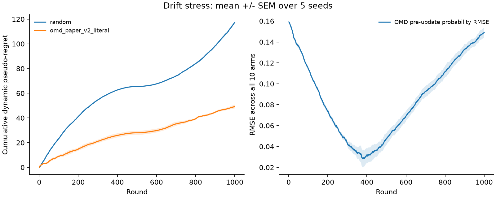

# Bandit v2.1 阶段报告

本报告由本次原始日志生成；时间数据属于本次机器及运行。

## 范围与配置

E8/E9 既有验收由归档和本次回归测试覆盖；本次重新执行 E10、E11、E12。
固定 d=3、K=10、T=1000、seeds=0..4；eta=3、lambda=126、S=2、delta=0.05。
正文原式 paper_v2_literal；保留论文正文与附录的时间因子差异，不主张已经消除理论歧义。
OMD 核心没有加入遗忘、重启、变化检测或调参。非平稳实验属于压力测试，不是 DOMD-GLB。

## 固定数据流与闭环的区别

E10 使用归档 E8 的同一 X/y 前缀及固定评估点；OMD 做 200 次更新，Batch 仅在 10/25/50/100/200 五个前缀从零重拟合。
E10 使用 eta=2、H1=I 的工程参数，Batch 使用损失求和+l2=1 的正则；两者不要求估计参数相等。
E11/E12 中选臂改变下一条观测。种子相同不代表两策略收到同一观测流。真参数仅用于环境与外部评估。

## 平稳闭环

| 算法 | 最终累计伪遗憾均值 | SEM |
|---|---:|---:|
| random | 254.444563 | 1.361251 |
| omd_paper_v2_literal | 69.271133 | 1.114940 |

## 计算与状态

| T | 更新 μs/步（3 次中位数） | 选择 μs/步 | theta+H 字节 |
|---|---:|---:|---:|
| 200 | 54.855 | 24.413 | 96 |
| 1000 | 60.304 | 25.933 | 96 |
| 5000 | 55.693 | 24.089 | 96 |

计时包含 instrumentation 开销；更新包含求解、投影、曲率及验证。线性求解是更新的子集；投影整体时间与线性求解有重叠，不能相加。
日志仅计 CSV 行格式化及缓冲写入，不含最终 flush/close。状态数组载荷不是峰值内存；实验日志存储随 T 增长。
固定 d 的状态数组大小由代码和记录共同支持；这些时间点不能证明渐近复杂度或普遍速度优势。

## 非平稳压力测试

突变：第1–500轮 theta=(1,-0.5,0.75)，第501轮起 theta=(-1,0.5,-0.75)。
漂移：alpha=(t-1)/999，在同一端点之间线性插值。采样、预测评估和 regret 均使用本轮 theta_t。
动态伪遗憾为 sum_t [max_a sigmoid(x_a^T theta_t)-sigmoid(x_A_t^T theta_t)]，比较点是每轮最优臂。
预测 RMSE 在本轮更新前对全部10个臂计算，避免用刚到的标签评估同一次预测。

| 场景 | 算法 | 最终动态伪遗憾均值 | SEM |
|---|---|---:|---:|
| abrupt | random | 226.165492 | 1.749034 |
| abrupt | omd_paper_v2_literal | 122.308784 | 2.248970 |
| drift | random | 117.119928 | 0.618906 |
| drift | omd_paper_v2_literal | 49.271495 | 1.520244 |

具体观察（同一场景跨5 seeds、每个窗口100轮均值）：

- abrupt：401–500轮预测 RMSE=0.110243，501–600轮=0.231666，901–1000轮=0.193847；对应每轮动态伪遗憾为 0.073053、0.178211、0.139850。
- drift：401–500轮预测 RMSE=0.037728，501–600轮=0.058360，901–1000轮=0.140780；对应每轮动态伪遗憾为 0.020959、0.017996、0.045867。

解释候选：累积 H 没有遗忘旧曲率，更新幅度会受历史状态影响；旧参数也可能在突变后失配。
替代解释：有限预算、奖励噪声、特征几何及较保守的固定置信半径也会影响预测与选臂；当前闭环无法把这些因素单独归因。
后续可用完全相同的固定数据流比较保留状态与已知变化点重置；这是独立诊断，尚未执行，不纳入本阶段成果。
渐变穿过零参数附近时各臂均值接近，regret 较小可能来自问题暂时容易，不能仅据此断言跟踪更好。

## 正确性、失败与复现

全套 pytest 日志见 pytest.log；受约束更新的独立 SLSQP 对照覆盖约束活跃与不活跃情况。
新增测试覆盖突变边界、漂移端点、退化平稳一致性、重复轨迹与错误指标拒绝；已有极端输入测试覆盖稳定 Logistic 计算。
全部求解异常计数并停止；不静默跳过、回退或自动重试。本次 solver_failures=0。
源代码快照、Git基线、依赖版本及原始CSV均保留；manifest验证文件全集、哈希、源码和逐轮指标。
从全新目录执行 python scripts/reproduce_v2_1.py --output-root artifacts/v2_1_local；随后对同目录加 --verify-only。
历史 E11 轨迹对照见 historical_comparison.json；若跨版本数值不一致则显式披露，不改 seed 或阈值追求旧数字。

## 人工验收与冻结

计算门槛通过不自动代表独立讲解已完成。请按 docs/v2_1_walkthrough.md 做约10分钟讲解，在阶段收尾记录中写明结论。
本报告覆盖工程线；不代替论文最小验证A、数学闭卷复盘或理论线验收。版本提交与标签以 Git 中的实际状态为准。
